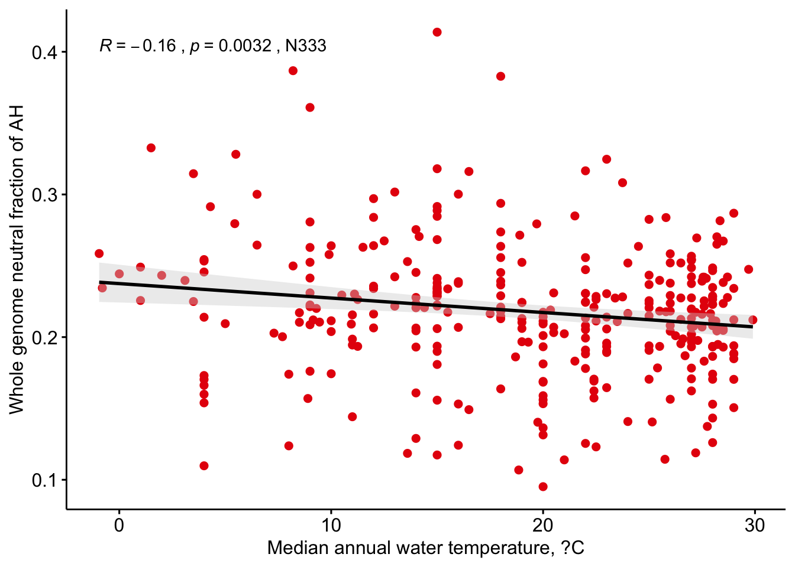
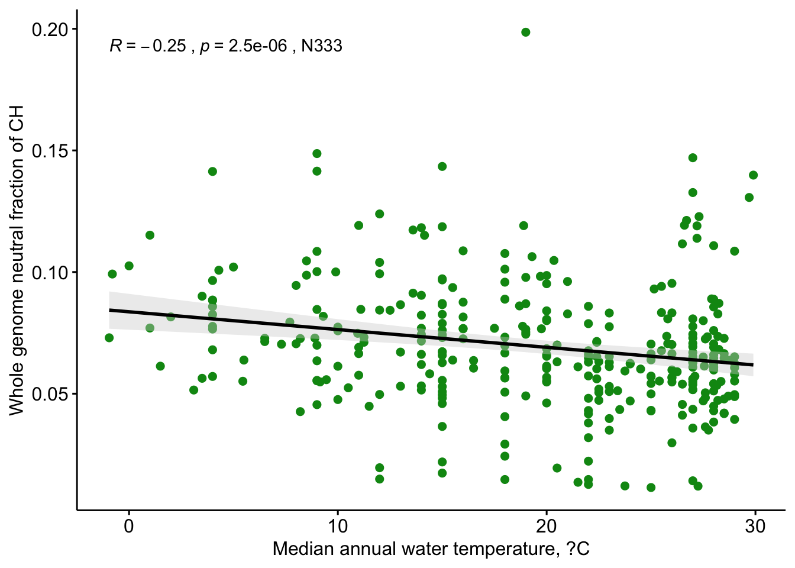
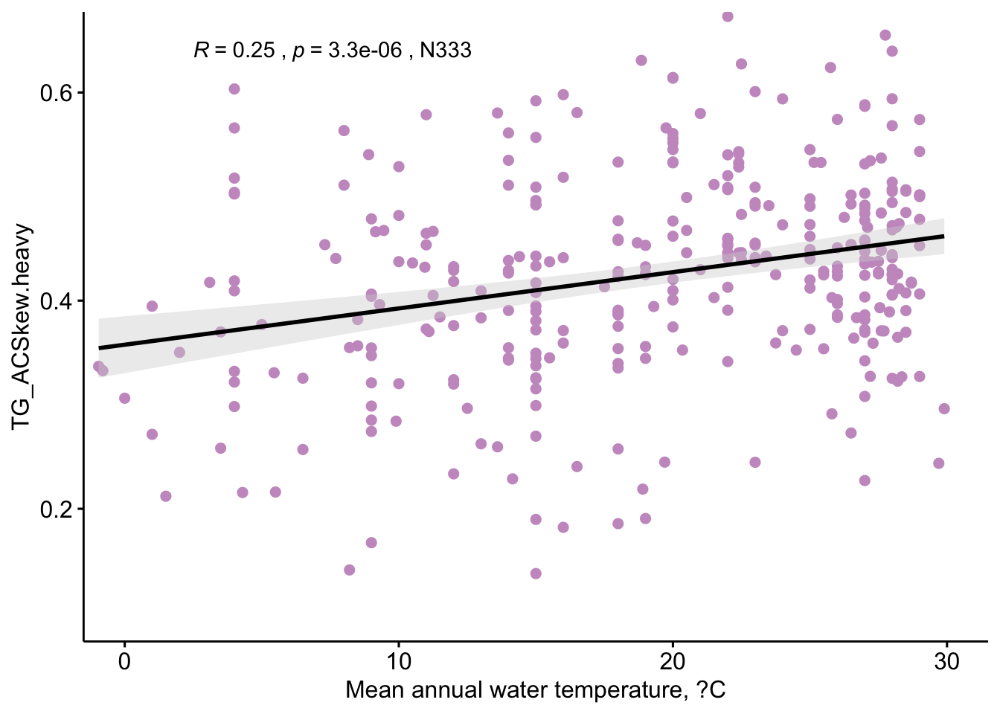
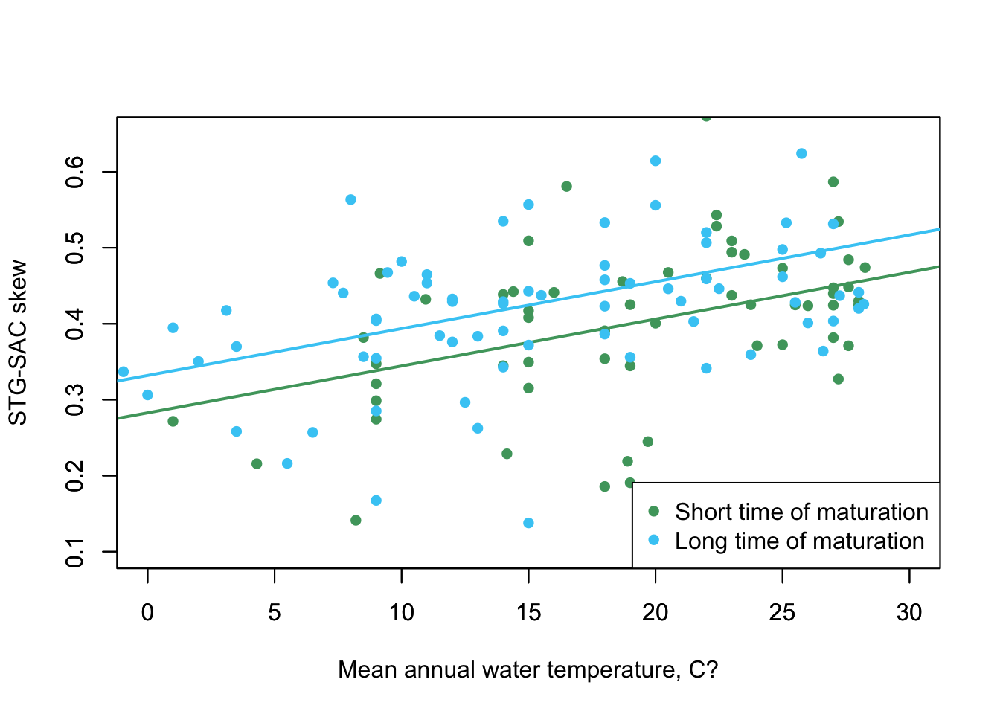

# Reading whole genomes database for Actinopterigii (LIGHT CHAIN NOTATION)


```r
AllSynNuc = read.table("../data/1raw/AllGenesCodonUsageNoOverlap.txt", header = TRUE, sep = '\t')
AllSynNuc = AllSynNuc[AllSynNuc$Gene != 'ND6',]
```

# Obtaining neutral nucleotide fractions in whole genomes

```r
AllSynNuc = aggregate(list(AllSynNuc$NeutralA,AllSynNuc$NeutralT,AllSynNuc$NeutralG,AllSynNuc$NeutralC), by = list(AllSynNuc$Species), FUN = sum)
names(AllSynNuc) = c('Species','NeutralA','NeutralT','NeutralG','NeutralC')
AllSynNuc$FrT.heavy = AllSynNuc$NeutralA / (AllSynNuc$NeutralA + AllSynNuc$NeutralT + AllSynNuc$NeutralG + AllSynNuc$NeutralC)
AllSynNuc$FrA.heavy = AllSynNuc$NeutralT / (AllSynNuc$NeutralA + AllSynNuc$NeutralT + AllSynNuc$NeutralG + AllSynNuc$NeutralC) 
AllSynNuc$FrC.heavy = AllSynNuc$NeutralG / (AllSynNuc$NeutralA + AllSynNuc$NeutralT + AllSynNuc$NeutralG + AllSynNuc$NeutralC) 
AllSynNuc$FrG.heavy = AllSynNuc$NeutralC / (AllSynNuc$NeutralA + AllSynNuc$NeutralT + AllSynNuc$NeutralG + AllSynNuc$NeutralC) 
```

# Merging neutral freqs with time of maturation and temperature

```r
tm = read.table('../Data/1raw/FishBaseTemperature.txt', header=T)
tm = tm %>% group_by(Species) %>% summarise(temperature = median(Temperature))
matur = read.table('../Data/1raw/FishBaseMaturity_Tm.txt', header=T)
matur = matur %>% group_by(Species) %>% summarise(matur_tm = median(Tm))
AllSynNuc = merge(AllSynNuc, tm, by='Species', all.x=T)
AllSynNuc = merge(AllSynNuc, matur, by='Species', all.x=T)
nrow(AllSynNuc[!is.na(AllSynNuc$temperature),])
```

```
## [1] 333
```

```r
nrow(AllSynNuc[!is.na(AllSynNuc$matur_tm),])
```

```
## [1] 217
```

# Correlations of neutral freqs with temperature
## Correlation of neutral freqs with temperature

```r
cor.test(AllSynNuc$temperature,AllSynNuc$FrA.heavy, method = "spearman")
```

```
## 
## 	Spearman's rank correlation rho
## 
## data:  AllSynNuc$temperature and AllSynNuc$FrA.heavy
## S = 7146877, p-value = 0.003163
## alternative hypothesis: true rho is not equal to 0
## sample estimates:
##        rho 
## -0.1612848
```

```r
cor.test(AllSynNuc$temperature,AllSynNuc$FrT.heavy, method = "spearman")
```

```
## 
## 	Spearman's rank correlation rho
## 
## data:  AllSynNuc$temperature and AllSynNuc$FrT.heavy
## S = 5342754, p-value = 0.01605
## alternative hypothesis: true rho is not equal to 0
## sample estimates:
##       rho 
## 0.1318643
```

```r
cor.test(AllSynNuc$temperature,AllSynNuc$FrG.heavy, method = "spearman")
```

```
## 
## 	Spearman's rank correlation rho
## 
## data:  AllSynNuc$temperature and AllSynNuc$FrG.heavy
## S = 5393869, p-value = 0.02414
## alternative hypothesis: true rho is not equal to 0
## sample estimates:
##       rho 
## 0.1235587
```

```r
cor.test(AllSynNuc$temperature,AllSynNuc$FrC.heavy, method = "spearman")  
```

```
## 
## 	Spearman's rank correlation rho
## 
## data:  AllSynNuc$temperature and AllSynNuc$FrC.heavy
## S = 7722465, p-value = 2.473e-06
## alternative hypothesis: true rho is not equal to 0
## sample estimates:
##        rho 
## -0.2548114
```

## Correlation of neutral freqs with time of maturation

```r
cor.test(AllSynNuc$matur_tm,AllSynNuc$FrA.heavy, method = "spearman")
```

```
## 
## 	Spearman's rank correlation rho
## 
## data:  AllSynNuc$matur_tm and AllSynNuc$FrA.heavy
## S = 1806200, p-value = 0.3744
## alternative hypothesis: true rho is not equal to 0
## sample estimates:
##         rho 
## -0.06058898
```

```r
cor.test(AllSynNuc$matur_tm,AllSynNuc$FrT.heavy, method = "spearman")
```

```
## 
## 	Spearman's rank correlation rho
## 
## data:  AllSynNuc$matur_tm and AllSynNuc$FrT.heavy
## S = 1260660, p-value = 0.0001084
## alternative hypothesis: true rho is not equal to 0
## sample estimates:
##       rho 
## 0.2597488
```

```r
cor.test(AllSynNuc$matur_tm,AllSynNuc$FrG.heavy, method = "spearman")
```

```
## 
## 	Spearman's rank correlation rho
## 
## data:  AllSynNuc$matur_tm and AllSynNuc$FrG.heavy
## S = 1812793, p-value = 0.3446
## alternative hypothesis: true rho is not equal to 0
## sample estimates:
##         rho 
## -0.06446041
```

```r
cor.test(AllSynNuc$matur_tm,AllSynNuc$FrC.heavy, method = "spearman")  
```

```
## 
## 	Spearman's rank correlation rho
## 
## data:  AllSynNuc$matur_tm and AllSynNuc$FrC.heavy
## S = 2024924, p-value = 0.005212
## alternative hypothesis: true rho is not equal to 0
## sample estimates:
##        rho 
## -0.1890223
```

## GAskew, TCskew, STG-SACSkew

```r
AllSynNuc$TtoCSkew.heavy = (AllSynNuc$FrT.heavy-AllSynNuc$FrC.heavy)/(AllSynNuc$FrT.heavy+AllSynNuc$FrC.heavy)
AllSynNuc$GtoASkew.heavy = (AllSynNuc$FrG.heavy-AllSynNuc$FrA.heavy)/(AllSynNuc$FrG.heavy+AllSynNuc$FrA.heavy)
cor.test(AllSynNuc$temperature,AllSynNuc$TtoCSkew.heavy, method = "spearman")
```

```
## 
## 	Spearman's rank correlation rho
## 
## data:  AllSynNuc$temperature and AllSynNuc$TtoCSkew.heavy
## S = 4658960, p-value = 7.307e-06
## alternative hypothesis: true rho is not equal to 0
## sample estimates:
##       rho 
## 0.2429729
```

```r
cor.test(AllSynNuc$temperature,AllSynNuc$GtoASkew.heavy, method = "spearman")
```

```
## 
## 	Spearman's rank correlation rho
## 
## data:  AllSynNuc$temperature and AllSynNuc$GtoASkew.heavy
## S = 5036258, p-value = 0.0008673
## alternative hypothesis: true rho is not equal to 0
## sample estimates:
##       rho 
## 0.1816663
```

```r
cor.test(AllSynNuc$matur_tm,AllSynNuc$TtoCSkew.heavy, method = "spearman")
```

```
## 
## 	Spearman's rank correlation rho
## 
## data:  AllSynNuc$matur_tm and AllSynNuc$TtoCSkew.heavy
## S = 1307537, p-value = 0.000564
## alternative hypothesis: true rho is not equal to 0
## sample estimates:
##       rho 
## 0.2322227
```

```r
cor.test(AllSynNuc$matur_tm,AllSynNuc$GtoASkew.heavy, method = "spearman")
```

```
## 
## 	Spearman's rank correlation rho
## 
## data:  AllSynNuc$matur_tm and AllSynNuc$GtoASkew.heavy
## S = 1697139, p-value = 0.9597
## alternative hypothesis: true rho is not equal to 0
## sample estimates:
##         rho 
## 0.003450675
```

```r
AllSynNuc$TG = AllSynNuc$FrT.heavy+AllSynNuc$FrG.heavy
AllSynNuc$AC = AllSynNuc$FrA.heavy+AllSynNuc$FrC.heavy
AllSynNuc$TG_ACSkew.heavy = (AllSynNuc$TG-AllSynNuc$AC)/(AllSynNuc$TG+AllSynNuc$AC)
```

# Figures

```r
AllSynNuc = AllSynNuc[!is.na(AllSynNuc$temperature),]; N = as.character(paste("N", nrow(AllSynNuc), sep="")) #delete NA
pdf("../Figures/WholeGenomeData.Actinopterygii.pdf")
f1= ggscatter(AllSynNuc, x = "temperature", y = "FrA.heavy",
          color = "#e61a0b", # Points color, shape and size
          add = "reg.line",  # Add regressin line
          add.params = list(color = "black", fill = "lightgray"), # Customize reg. line
          conf.int = TRUE, # Add confidence interval
          xlab="Median annual water temperature, ?C", ylab="Whole genome neutral fraction of AH")+stat_cor(method = "spearman", aes(label = paste(..r.label.., ..p.label.., ..N.., sep = "~`,`~")))
f1
f2=ggscatter(AllSynNuc, x = "temperature", y = "FrC.heavy",
          color = "#009414", # Points color, shape and size
          add = "reg.line",  # Add regressin line
          add.params = list(color = "black", fill = "lightgray"), # Customize reg. line
          conf.int = TRUE, # Add confidence interval
          xlab="Median annual water temperature, ?C", ylab="Whole genome neutral fraction of CH")+stat_cor(method = "spearman", aes(label = paste(..r.label.., ..p.label.., ..N.., sep = "~`,`~")))
f2
f3=ggscatter(AllSynNuc, x = "temperature", y = "FrG.heavy",
          color = "#5c5c5c", # Points color, shape and size
          add = "reg.line",  # Add regressin line
          add.params = list(color = "black", fill = "lightgray"), # Customize reg. line
          conf.int = TRUE, # Add confidence interval
          xlab="Median annual water temperature, ?C", ylab="Whole genome neutral fraction of GH")+stat_cor(method = "spearman", aes(label = paste(..r.label.., ..p.label.., ..N.., sep = "~`,`~")))
f3
f4=ggscatter(AllSynNuc, x = "temperature", y = "FrT.heavy",
          color = "#0918e6", # Points color, shape and size
          add = "reg.line",  # Add regressin line
          add.params = list(color = "black", fill = "lightgray"), # Customize reg. line
          conf.int = TRUE, # Add confidence interval
          xlab="Median annual water temperature, ?C", ylab="Whole genome neutral fraction of TH")+stat_cor(method = "spearman", aes(label = paste(..r.label.., ..p.label.., ..N.., sep = "~`,`~")))
f4
dev.off()
```

```
## quartz_off_screen 
##                 2
```

```r
f1
```



```r
f2
```



```r
f3
```


```r
f4
```


```r
pdf("../Figures/WholeGenomeData.Actinopterygii.TG-SACskew.pdf", width = 7, height = 8.5)
f5=ggscatter(AllSynNuc, x = "temperature", y = "TG_ACSkew.heavy",
          color = "#c99bc9", # Points color, shape and size
          add = "reg.line",  # Add regressin line
          add.params = list(color = "black", fill = "lightgray"), # Customize reg. line
          conf.int = TRUE, # Add confidence interval
          xlab="Mean annual water temperature, ?C",  ylim=c(0.1, 0.65), xlim=c(0,30))+stat_cor(method = "spearman", label.x = 2.5, label.y = 0.64, aes(label = paste(..r.label.., ..p.label.., ..N.., sep = "~`,`~")))
f5
dev.off()
```

```
## quartz_off_screen 
##                 2
```

```r
f5
```



# LM

```r
summary(lm(GtoASkew.heavy ~ temperature, data = AllSynNuc))
```

```
## 
## Call:
## lm(formula = GtoASkew.heavy ~ temperature, data = AllSynNuc)
## 
## Residuals:
##      Min       1Q   Median       3Q      Max 
## -0.63316 -0.05884  0.01729  0.08228  0.45087 
## 
## Coefficients:
##             Estimate Std. Error t value Pr(>|t|)    
## (Intercept) 0.174308   0.022339   7.803 8.01e-14 ***
## temperature 0.002867   0.001075   2.667  0.00802 ** 
## ---
## Signif. codes:  0 '***' 0.001 '**' 0.01 '*' 0.05 '.' 0.1 ' ' 1
## 
## Residual standard error: 0.1516 on 331 degrees of freedom
## Multiple R-squared:  0.02104,	Adjusted R-squared:  0.01809 
## F-statistic: 7.115 on 1 and 331 DF,  p-value: 0.008021
```

```r
summary(lm(TtoCSkew.heavy ~ temperature, data = AllSynNuc))
```

```
## 
## Call:
## lm(formula = TtoCSkew.heavy ~ temperature, data = AllSynNuc)
## 
## Residuals:
##      Min       1Q   Median       3Q      Max 
## -0.50579 -0.05680  0.00279  0.07364  0.28582 
## 
## Coefficients:
##              Estimate Std. Error t value Pr(>|t|)    
## (Intercept) 0.6054590  0.0176069  34.388  < 2e-16 ***
## temperature 0.0036119  0.0008472   4.263 2.63e-05 ***
## ---
## Signif. codes:  0 '***' 0.001 '**' 0.01 '*' 0.05 '.' 0.1 ' ' 1
## 
## Residual standard error: 0.1195 on 331 degrees of freedom
## Multiple R-squared:  0.05205,	Adjusted R-squared:  0.04919 
## F-statistic: 18.17 on 1 and 331 DF,  p-value: 2.632e-05
```

```r
summary(lm(TG_ACSkew.heavy ~ temperature, data = AllSynNuc))
```

```
## 
## Call:
## lm(formula = TG_ACSkew.heavy ~ temperature, data = AllSynNuc)
## 
## Residuals:
##       Min        1Q    Median        3Q       Max 
## -0.272227 -0.054852  0.001898  0.051398  0.261634 
## 
## Coefficients:
##              Estimate Std. Error t value Pr(>|t|)    
## (Intercept) 0.3576532  0.0138913  25.747  < 2e-16 ***
## temperature 0.0034870  0.0006684   5.217 3.22e-07 ***
## ---
## Signif. codes:  0 '***' 0.001 '**' 0.01 '*' 0.05 '.' 0.1 ' ' 1
## 
## Residual standard error: 0.09429 on 331 degrees of freedom
## Multiple R-squared:  0.07597,	Adjusted R-squared:  0.07318 
## F-statistic: 27.21 on 1 and 331 DF,  p-value: 3.218e-07
```

```r
summary(lm(FrA.heavy ~ scale(temperature)+scale(matur_tm), data = AllSynNuc))
```

```
## 
## Call:
## lm(formula = FrA.heavy ~ scale(temperature) + scale(matur_tm), 
##     data = AllSynNuc)
## 
## Residuals:
##       Min        1Q    Median        3Q       Max 
## -0.097838 -0.023190 -0.005652  0.022639  0.178615 
## 
## Coefficients:
##                     Estimate Std. Error t value Pr(>|t|)    
## (Intercept)         0.224859   0.004302  52.271  < 2e-16 ***
## scale(temperature) -0.016369   0.004349  -3.764 0.000254 ***
## scale(matur_tm)    -0.007841   0.004292  -1.827 0.070052 .  
## ---
## Signif. codes:  0 '***' 0.001 '**' 0.01 '*' 0.05 '.' 0.1 ' ' 1
## 
## Residual standard error: 0.04743 on 128 degrees of freedom
##   (202 observations deleted due to missingness)
## Multiple R-squared:  0.1051,	Adjusted R-squared:  0.09109 
## F-statistic: 7.514 on 2 and 128 DF,  p-value: 0.0008213
```

```r
summary(lm(FrA.heavy ~ log2(temperature + 2)*log2(matur_tm), data = AllSynNuc))  
```

```
## 
## Call:
## lm(formula = FrA.heavy ~ log2(temperature + 2) * log2(matur_tm), 
##     data = AllSynNuc)
## 
## Residuals:
##       Min        1Q    Median        3Q       Max 
## -0.102887 -0.022056 -0.006305  0.022909  0.183016 
## 
## Coefficients:
##                                       Estimate Std. Error t value Pr(>|t|)    
## (Intercept)                           0.422770   0.050387   8.390 8.02e-14 ***
## log2(temperature + 2)                -0.043535   0.011464  -3.798 0.000225 ***
## log2(matur_tm)                       -0.055592   0.019986  -2.782 0.006234 ** 
## log2(temperature + 2):log2(matur_tm)  0.011796   0.004637   2.544 0.012156 *  
## ---
## Signif. codes:  0 '***' 0.001 '**' 0.01 '*' 0.05 '.' 0.1 ' ' 1
## 
## Residual standard error: 0.04706 on 127 degrees of freedom
##   (202 observations deleted due to missingness)
## Multiple R-squared:  0.126,	Adjusted R-squared:  0.1053 
## F-statistic: 6.102 on 3 and 127 DF,  p-value: 0.0006525
```

```r
summary(lm(FrA.heavy ~ log2(temperature + 2)+log2(matur_tm), data = AllSynNuc))
```

```
## 
## Call:
## lm(formula = FrA.heavy ~ log2(temperature + 2) + log2(matur_tm), 
##     data = AllSynNuc)
## 
## Residuals:
##       Min        1Q    Median        3Q       Max 
## -0.102033 -0.024677 -0.005238  0.019776  0.186162 
## 
## Coefficients:
##                        Estimate Std. Error t value Pr(>|t|)    
## (Intercept)            0.309754   0.024281  12.757  < 2e-16 ***
## log2(temperature + 2) -0.017552   0.005317  -3.301  0.00125 ** 
## log2(matur_tm)        -0.005453   0.003387  -1.610  0.10989    
## ---
## Signif. codes:  0 '***' 0.001 '**' 0.01 '*' 0.05 '.' 0.1 ' ' 1
## 
## Residual standard error: 0.04806 on 128 degrees of freedom
##   (202 observations deleted due to missingness)
## Multiple R-squared:  0.08145,	Adjusted R-squared:  0.0671 
## F-statistic: 5.675 on 2 and 128 DF,  p-value: 0.004351
```

```r
summary(lm(FrT.heavy ~ log2(temperature + 2)+log2(matur_tm), data = AllSynNuc)) # strong
```

```
## 
## Call:
## lm(formula = FrT.heavy ~ log2(temperature + 2) + log2(matur_tm), 
##     data = AllSynNuc)
## 
## Residuals:
##       Min        1Q    Median        3Q       Max 
## -0.092440 -0.034027 -0.007309  0.025683  0.182709 
## 
## Coefficients:
##                       Estimate Std. Error t value Pr(>|t|)    
## (Intercept)           0.249276   0.026709   9.333 4.08e-16 ***
## log2(temperature + 2) 0.023023   0.005849   3.936 0.000135 ***
## log2(matur_tm)        0.014498   0.003726   3.891 0.000160 ***
## ---
## Signif. codes:  0 '***' 0.001 '**' 0.01 '*' 0.05 '.' 0.1 ' ' 1
## 
## Residual standard error: 0.05286 on 128 degrees of freedom
##   (202 observations deleted due to missingness)
## Multiple R-squared:  0.1562,	Adjusted R-squared:  0.143 
## F-statistic: 11.85 on 2 and 128 DF,  p-value: 1.904e-05
```

```r
summary(lm(FrA.heavy ~ log2(temperature + 2)+log2(matur_tm), data = AllSynNuc)) # strong
```

```
## 
## Call:
## lm(formula = FrA.heavy ~ log2(temperature + 2) + log2(matur_tm), 
##     data = AllSynNuc)
## 
## Residuals:
##       Min        1Q    Median        3Q       Max 
## -0.102033 -0.024677 -0.005238  0.019776  0.186162 
## 
## Coefficients:
##                        Estimate Std. Error t value Pr(>|t|)    
## (Intercept)            0.309754   0.024281  12.757  < 2e-16 ***
## log2(temperature + 2) -0.017552   0.005317  -3.301  0.00125 ** 
## log2(matur_tm)        -0.005453   0.003387  -1.610  0.10989    
## ---
## Signif. codes:  0 '***' 0.001 '**' 0.01 '*' 0.05 '.' 0.1 ' ' 1
## 
## Residual standard error: 0.04806 on 128 degrees of freedom
##   (202 observations deleted due to missingness)
## Multiple R-squared:  0.08145,	Adjusted R-squared:  0.0671 
## F-statistic: 5.675 on 2 and 128 DF,  p-value: 0.004351
```

```r
summary(lm(TG_ACSkew.heavy ~ log2(temperature + 2)+log2(matur_tm), data = AllSynNuc))
```

```
## 
## Call:
## lm(formula = TG_ACSkew.heavy ~ log2(temperature + 2) + log2(matur_tm), 
##     data = AllSynNuc)
## 
## Residuals:
##       Min        1Q    Median        3Q       Max 
## -0.278793 -0.044010  0.002484  0.050503  0.250963 
## 
## Coefficients:
##                       Estimate Std. Error t value Pr(>|t|)    
## (Intercept)           0.140140   0.043625   3.212  0.00167 ** 
## log2(temperature + 2) 0.056133   0.009553   5.876 3.42e-08 ***
## log2(matur_tm)        0.024618   0.006086   4.045 8.99e-05 ***
## ---
## Signif. codes:  0 '***' 0.001 '**' 0.01 '*' 0.05 '.' 0.1 ' ' 1
## 
## Residual standard error: 0.08634 on 128 degrees of freedom
##   (202 observations deleted due to missingness)
## Multiple R-squared:   0.24,	Adjusted R-squared:  0.2282 
## F-statistic: 20.22 on 2 and 128 DF,  p-value: 2.346e-08
```

```r
summary(lm(TG_ACSkew.heavy ~ scale(temperature + 2)+scale(matur_tm), data = AllSynNuc))# ###PICS
```

```
## 
## Call:
## lm(formula = TG_ACSkew.heavy ~ scale(temperature + 2) + scale(matur_tm), 
##     data = AllSynNuc)
## 
## Residuals:
##       Min        1Q    Median        3Q       Max 
## -0.252806 -0.044391 -0.001959  0.054465  0.251003 
## 
## Coefficients:
##                        Estimate Std. Error t value Pr(>|t|)    
## (Intercept)            0.421937   0.007746  54.471  < 2e-16 ***
## scale(temperature + 2) 0.047876   0.007832   6.113 1.10e-08 ***
## scale(matur_tm)        0.031083   0.007729   4.022 9.82e-05 ***
## ---
## Signif. codes:  0 '***' 0.001 '**' 0.01 '*' 0.05 '.' 0.1 ' ' 1
## 
## Residual standard error: 0.08541 on 128 degrees of freedom
##   (202 observations deleted due to missingness)
## Multiple R-squared:  0.2563,	Adjusted R-squared:  0.2447 
## F-statistic: 22.06 on 2 and 128 DF,  p-value: 5.876e-09
```

```r
summary(lm(GtoASkew.heavy ~ scale(temperature + 2)+scale(matur_tm), data = AllSynNuc))
```

```
## 
## Call:
## lm(formula = GtoASkew.heavy ~ scale(temperature + 2) + scale(matur_tm), 
##     data = AllSynNuc)
## 
## Residuals:
##      Min       1Q   Median       3Q      Max 
## -0.59112 -0.04943  0.03187  0.08699  0.31324 
## 
## Coefficients:
##                        Estimate Std. Error t value Pr(>|t|)    
## (Intercept)             0.20311    0.01468  13.832  < 2e-16 ***
## scale(temperature + 2)  0.04612    0.01485   3.106  0.00233 ** 
## scale(matur_tm)         0.01452    0.01465   0.991  0.32360    
## ---
## Signif. codes:  0 '***' 0.001 '**' 0.01 '*' 0.05 '.' 0.1 ' ' 1
## 
## Residual standard error: 0.1619 on 128 degrees of freedom
##   (202 observations deleted due to missingness)
## Multiple R-squared:  0.07047,	Adjusted R-squared:  0.05594 
## F-statistic: 4.852 on 2 and 128 DF,  p-value: 0.009311
```

```r
summary(lm(TtoCSkew.heavy ~ scale(temperature + 2)+scale(matur_tm), data = AllSynNuc))
```

```
## 
## Call:
## lm(formula = TtoCSkew.heavy ~ scale(temperature + 2) + scale(matur_tm), 
##     data = AllSynNuc)
## 
## Residuals:
##      Min       1Q   Median       3Q      Max 
## -0.50945 -0.07478  0.01413  0.08168  0.25677 
## 
## Coefficients:
##                        Estimate Std. Error t value Pr(>|t|)    
## (Intercept)             0.70170    0.01130  62.077  < 2e-16 ***
## scale(temperature + 2)  0.04000    0.01143   3.500 0.000641 ***
## scale(matur_tm)         0.04201    0.01128   3.725 0.000292 ***
## ---
## Signif. codes:  0 '***' 0.001 '**' 0.01 '*' 0.05 '.' 0.1 ' ' 1
## 
## Residual standard error: 0.1246 on 128 degrees of freedom
##   (202 observations deleted due to missingness)
## Multiple R-squared:  0.1408,	Adjusted R-squared:  0.1274 
## F-statistic: 10.49 on 2 and 128 DF,  p-value: 6.043e-05
```

```r
summary(lm(GtoASkew.heavy ~ scale(temperature + 2)*scale(matur_tm), data = AllSynNuc))
```

```
## 
## Call:
## lm(formula = GtoASkew.heavy ~ scale(temperature + 2) * scale(matur_tm), 
##     data = AllSynNuc)
## 
## Residuals:
##      Min       1Q   Median       3Q      Max 
## -0.58055 -0.04920  0.02315  0.08590  0.32282 
## 
## Coefficients:
##                                        Estimate Std. Error t value Pr(>|t|)    
## (Intercept)                             0.19148    0.01482  12.921  < 2e-16 ***
## scale(temperature + 2)                  0.04516    0.01443   3.129  0.00218 ** 
## scale(matur_tm)                        -0.01501    0.01748  -0.859  0.39210    
## scale(temperature + 2):scale(matur_tm) -0.04722    0.01621  -2.914  0.00422 ** 
## ---
## Signif. codes:  0 '***' 0.001 '**' 0.01 '*' 0.05 '.' 0.1 ' ' 1
## 
## Residual standard error: 0.1574 on 127 degrees of freedom
##   (202 observations deleted due to missingness)
## Multiple R-squared:  0.1287,	Adjusted R-squared:  0.1081 
## F-statistic: 6.254 on 3 and 127 DF,  p-value: 0.0005404
```

```r
summary(lm(TtoCSkew.heavy ~ scale(temperature + 2)*scale(matur_tm), data = AllSynNuc))
```

```
## 
## Call:
## lm(formula = TtoCSkew.heavy ~ scale(temperature + 2) * scale(matur_tm), 
##     data = AllSynNuc)
## 
## Residuals:
##      Min       1Q   Median       3Q      Max 
## -0.50726 -0.07330  0.01218  0.07964  0.25282 
## 
## Coefficients:
##                                        Estimate Std. Error t value Pr(>|t|)    
## (Intercept)                             0.70959    0.01149  61.738  < 2e-16 ***
## scale(temperature + 2)                  0.04065    0.01119   3.631 0.000408 ***
## scale(matur_tm)                         0.06204    0.01356   4.577 1.11e-05 ***
## scale(temperature + 2):scale(matur_tm)  0.03202    0.01257   2.548 0.012036 *  
## ---
## Signif. codes:  0 '***' 0.001 '**' 0.01 '*' 0.05 '.' 0.1 ' ' 1
## 
## Residual standard error: 0.1221 on 127 degrees of freedom
##   (202 observations deleted due to missingness)
## Multiple R-squared:  0.1826,	Adjusted R-squared:  0.1633 
## F-statistic: 9.457 on 3 and 127 DF,  p-value: 1.099e-05
```

```r
nrow(AllSynNuc[!is.na(AllSynNuc$temperature) & !is.na(AllSynNuc$matur_tm),])
```

```
## [1] 131
```

```r
summary(lm(temperature ~ GtoASkew.heavy +TtoCSkew.heavy, data = AllSynNuc))
```

```
## 
## Call:
## lm(formula = temperature ~ GtoASkew.heavy + TtoCSkew.heavy, data = AllSynNuc)
## 
## Residuals:
##      Min       1Q   Median       3Q      Max 
## -18.5579  -5.1025   0.8364   6.1197  17.0925 
## 
## Coefficients:
##                Estimate Std. Error t value Pr(>|t|)    
## (Intercept)       5.646      2.514   2.246 0.025351 *  
## GtoASkew.heavy    9.955      2.709   3.674 0.000278 ***
## TtoCSkew.heavy   16.824      3.383   4.974 1.06e-06 ***
## ---
## Signif. codes:  0 '***' 0.001 '**' 0.01 '*' 0.05 '.' 0.1 ' ' 1
## 
## Residual standard error: 7.41 on 330 degrees of freedom
## Multiple R-squared:  0.08931,	Adjusted R-squared:  0.08379 
## F-statistic: 16.18 on 2 and 330 DF,  p-value: 1.978e-07
```

```r
summary(lm(matur_tm ~ GtoASkew.heavy +TtoCSkew.heavy, data = AllSynNuc))
```

```
## 
## Call:
## lm(formula = matur_tm ~ GtoASkew.heavy + TtoCSkew.heavy, data = AllSynNuc)
## 
## Residuals:
##     Min      1Q  Median      3Q     Max 
## -4.8874 -2.6119 -1.1871  0.7691 22.2711 
## 
## Coefficients:
##                Estimate Std. Error t value Pr(>|t|)   
## (Intercept)      -2.828      2.403  -1.177  0.24145   
## GtoASkew.heavy    3.132      2.512   1.247  0.21477   
## TtoCSkew.heavy    9.703      3.137   3.093  0.00244 **
## ---
## Signif. codes:  0 '***' 0.001 '**' 0.01 '*' 0.05 '.' 0.1 ' ' 1
## 
## Residual standard error: 4.503 on 128 degrees of freedom
##   (202 observations deleted due to missingness)
## Multiple R-squared:  0.06989,	Adjusted R-squared:  0.05536 
## F-statistic: 4.809 on 2 and 128 DF,  p-value: 0.009684
```

```r
summary(lm(temperature ~ scale(GtoASkew.heavy) +scale(TtoCSkew.heavy), data = AllSynNuc))
```

```
## 
## Call:
## lm(formula = temperature ~ scale(GtoASkew.heavy) + scale(TtoCSkew.heavy), 
##     data = AllSynNuc)
## 
## Residuals:
##      Min       1Q   Median       3Q      Max 
## -18.5579  -5.1025   0.8364   6.1197  17.0925 
## 
## Coefficients:
##                       Estimate Std. Error t value Pr(>|t|)    
## (Intercept)            19.2908     0.4061  47.505  < 2e-16 ***
## scale(GtoASkew.heavy)   1.5234     0.4146   3.674 0.000278 ***
## scale(TtoCSkew.heavy)   2.0620     0.4146   4.974 1.06e-06 ***
## ---
## Signif. codes:  0 '***' 0.001 '**' 0.01 '*' 0.05 '.' 0.1 ' ' 1
## 
## Residual standard error: 7.41 on 330 degrees of freedom
## Multiple R-squared:  0.08931,	Adjusted R-squared:  0.08379 
## F-statistic: 16.18 on 2 and 330 DF,  p-value: 1.978e-07
```

```r
summary(lm(matur_tm ~ scale(GtoASkew.heavy) +scale(TtoCSkew.heavy), data = AllSynNuc))
```

```
## 
## Call:
## lm(formula = matur_tm ~ scale(GtoASkew.heavy) + scale(TtoCSkew.heavy), 
##     data = AllSynNuc)
## 
## Residuals:
##     Min      1Q  Median      3Q     Max 
## -4.8874 -2.6119 -1.1871  0.7691 22.2711 
## 
## Coefficients:
##                       Estimate Std. Error t value Pr(>|t|)    
## (Intercept)             4.4415     0.4044  10.984  < 2e-16 ***
## scale(GtoASkew.heavy)   0.4793     0.3844   1.247  0.21477    
## scale(TtoCSkew.heavy)   1.1892     0.3845   3.093  0.00244 ** 
## ---
## Signif. codes:  0 '***' 0.001 '**' 0.01 '*' 0.05 '.' 0.1 ' ' 1
## 
## Residual standard error: 4.503 on 128 degrees of freedom
##   (202 observations deleted due to missingness)
## Multiple R-squared:  0.06989,	Adjusted R-squared:  0.05536 
## F-statistic: 4.809 on 2 and 128 DF,  p-value: 0.009684
```

# PGLS

```r
tree = read.tree('../Data/1raw/mtalign.aln.treefile.rooted')

row.names(AllSynNuc) = AllSynNuc$Species
tree_pruned = treedata(tree, AllSynNuc, sort=T, warnings=T)$phy

data<-as.data.frame(treedata(tree_pruned, AllSynNuc, sort=T, warnings=T)$data)
data$Species = as.character(data$Species)
data$TG_ACSkew.heavy = as.numeric(as.character(data$TG_ACSkew.heavy))
data$GtoASkew.heavy = as.numeric(as.character(data$GtoASkew.heavy))
data$TtoCSkew.heavy = as.numeric(as.character(data$TtoCSkew.heavy))
data$temperature = as.numeric(as.character(data$temperature))
data$matur_tm = as.numeric(as.character(data$matur_tm))
data_comp <- comparative.data(tree_pruned, data, Species, vcv=TRUE)


summary(pgls(GtoASkew.heavy ~ temperature, data_comp, lambda="ML"))
```

```
## 
## Call:
## pgls(formula = GtoASkew.heavy ~ temperature, data = data_comp, 
##     lambda = "ML")
## 
## Residuals:
##      Min       1Q   Median       3Q      Max 
## -1.34884 -0.23789  0.04779  0.27892  1.12656 
## 
## Branch length transformations:
## 
## kappa  [Fix]  : 1.000
## lambda [ ML]  : 1.000
##    lower bound : 0.000, p = < 2.22e-16
##    upper bound : 1.000, p = 1    
##    95.0% CI   : (0.989, NA)
## delta  [Fix]  : 1.000
## 
## Coefficients:
##              Estimate Std. Error t value Pr(>|t|)
## (Intercept) 0.1158136  0.1092327  1.0602   0.2910
## temperature 0.0015013  0.0010491  1.4311   0.1548
## 
## Residual standard error: 0.433 on 129 degrees of freedom
## Multiple R-squared: 0.01563,	Adjusted R-squared: 0.007997 
## F-statistic: 2.048 on 1 and 129 DF,  p-value: 0.1548
```

```r
summary(pgls(TtoCSkew.heavy ~ temperature, data_comp, lambda="ML"))
```

```
## 
## Call:
## pgls(formula = TtoCSkew.heavy ~ temperature, data = data_comp, 
##     lambda = "ML")
## 
## Residuals:
##     Min      1Q  Median      3Q     Max 
## -0.7723 -0.1694 -0.0115  0.1925  0.8334 
## 
## Branch length transformations:
## 
## kappa  [Fix]  : 1.000
## lambda [ ML]  : 0.979
##    lower bound : 0.000, p = < 2.22e-16
##    upper bound : 1.000, p = 0.0055516
##    95.0% CI   : (0.908, 0.997)
## delta  [Fix]  : 1.000
## 
## Coefficients:
##               Estimate Std. Error t value Pr(>|t|)    
## (Intercept) 0.76067668 0.07776190  9.7821   <2e-16 ***
## temperature 0.00073197 0.00110493  0.6625   0.5089    
## ---
## Signif. codes:  0 '***' 0.001 '**' 0.01 '*' 0.05 '.' 0.1 ' ' 1
## 
## Residual standard error: 0.3064 on 129 degrees of freedom
## Multiple R-squared: 0.00339,	Adjusted R-squared: -0.004335 
## F-statistic: 0.4388 on 1 and 129 DF,  p-value: 0.5089
```

```r
summary(pgls(TG_ACSkew.heavy ~ temperature, data_comp, lambda="ML"))
```

```
## 
## Call:
## pgls(formula = TG_ACSkew.heavy ~ temperature, data = data_comp, 
##     lambda = "ML")
## 
## Residuals:
##      Min       1Q   Median       3Q      Max 
## -0.68488 -0.15040  0.02731  0.17087  0.60117 
## 
## Branch length transformations:
## 
## kappa  [Fix]  : 1.000
## lambda [ ML]  : 0.991
##    lower bound : 0.000, p = < 2.22e-16
##    upper bound : 1.000, p = 0.045105
##    95.0% CI   : (0.965, 1.000)
## delta  [Fix]  : 1.000
## 
## Coefficients:
##               Estimate Std. Error t value  Pr(>|t|)    
## (Intercept) 0.40049676 0.06164998  6.4963 1.629e-09 ***
## temperature 0.00130582 0.00078302  1.6677   0.09781 .  
## ---
## Signif. codes:  0 '***' 0.001 '**' 0.01 '*' 0.05 '.' 0.1 ' ' 1
## 
## Residual standard error: 0.2432 on 129 degrees of freedom
## Multiple R-squared: 0.0211,	Adjusted R-squared: 0.01352 
## F-statistic: 2.781 on 1 and 129 DF,  p-value: 0.09781
```

```r
summary(pgls(log2(temperature+2) ~ TG_ACSkew.heavy, data_comp, lambda="ML"))
```

```
## 
## Call:
## pgls(formula = log2(temperature + 2) ~ TG_ACSkew.heavy, data = data_comp, 
##     lambda = "ML")
## 
## Residuals:
##     Min      1Q  Median      3Q     Max 
## -5.2033 -1.0455 -0.0367  1.0606  3.9696 
## 
## Branch length transformations:
## 
## kappa  [Fix]  : 1.000
## lambda [ ML]  : 0.867
##    lower bound : 0.000, p = 8.323e-10
##    upper bound : 1.000, p = < 2.22e-16
##    95.0% CI   : (0.731, 0.940)
## delta  [Fix]  : 1.000
## 
## Coefficients:
##                 Estimate Std. Error t value  Pr(>|t|)    
## (Intercept)      3.06190    0.50529  6.0597 1.398e-08 ***
## TG_ACSkew.heavy  2.28060    0.74592  3.0574  0.002715 ** 
## ---
## Signif. codes:  0 '***' 0.001 '**' 0.01 '*' 0.05 '.' 0.1 ' ' 1
## 
## Residual standard error: 1.656 on 129 degrees of freedom
## Multiple R-squared: 0.06757,	Adjusted R-squared: 0.06034 
## F-statistic: 9.348 on 1 and 129 DF,  p-value: 0.002715
```

```r
summary(pgls(TG_ACSkew.heavy ~ scale(temperature), data_comp, lambda="ML"))
```

```
## 
## Call:
## pgls(formula = TG_ACSkew.heavy ~ scale(temperature), data = data_comp, 
##     lambda = "ML")
## 
## Residuals:
##      Min       1Q   Median       3Q      Max 
## -0.68488 -0.15040  0.02731  0.17087  0.60117 
## 
## Branch length transformations:
## 
## kappa  [Fix]  : 1.000
## lambda [ ML]  : 0.991
##    lower bound : 0.000, p = < 2.22e-16
##    upper bound : 1.000, p = 0.045105
##    95.0% CI   : (0.965, 1.000)
## delta  [Fix]  : 1.000
## 
## Coefficients:
##                     Estimate Std. Error t value  Pr(>|t|)    
## (Intercept)        0.4230073  0.0605215  6.9894 1.325e-10 ***
## scale(temperature) 0.0099763  0.0059821  1.6677   0.09781 .  
## ---
## Signif. codes:  0 '***' 0.001 '**' 0.01 '*' 0.05 '.' 0.1 ' ' 1
## 
## Residual standard error: 0.2432 on 129 degrees of freedom
## Multiple R-squared: 0.0211,	Adjusted R-squared: 0.01352 
## F-statistic: 2.781 on 1 and 129 DF,  p-value: 0.09781
```

```r
summary(pgls(TG_ACSkew.heavy ~ log2(temperature + 2) + log2(matur_tm), data_comp, lambda="ML"))
```

```
## 
## Call:
## pgls(formula = TG_ACSkew.heavy ~ log2(temperature + 2) + log2(matur_tm), 
##     data = data_comp, lambda = "ML")
## 
## Residuals:
##      Min       1Q   Median       3Q      Max 
## -0.62709 -0.13273  0.01202  0.14786  0.53835 
## 
## Branch length transformations:
## 
## kappa  [Fix]  : 1.000
## lambda [ ML]  : 0.986
##    lower bound : 0.000, p = < 2.22e-16
##    upper bound : 1.000, p = 0.020297
##    95.0% CI   : (0.952, 0.999)
## delta  [Fix]  : 1.000
## 
## Coefficients:
##                        Estimate Std. Error t value  Pr(>|t|)    
## (Intercept)           0.3198276  0.0710289  4.5028 1.491e-05 ***
## log2(temperature + 2) 0.0184000  0.0085997  2.1396   0.03428 *  
## log2(matur_tm)        0.0097012  0.0048475  2.0013   0.04748 *  
## ---
## Signif. codes:  0 '***' 0.001 '**' 0.01 '*' 0.05 '.' 0.1 ' ' 1
## 
## Residual standard error: 0.2356 on 128 degrees of freedom
## Multiple R-squared: 0.05007,	Adjusted R-squared: 0.03522 
## F-statistic: 3.373 on 2 and 128 DF,  p-value: 0.03736
```

```r
summary(pgls(TG_ACSkew.heavy ~ temperature, data_comp, lambda="ML"))
```

```
## 
## Call:
## pgls(formula = TG_ACSkew.heavy ~ temperature, data = data_comp, 
##     lambda = "ML")
## 
## Residuals:
##      Min       1Q   Median       3Q      Max 
## -0.68488 -0.15040  0.02731  0.17087  0.60117 
## 
## Branch length transformations:
## 
## kappa  [Fix]  : 1.000
## lambda [ ML]  : 0.991
##    lower bound : 0.000, p = < 2.22e-16
##    upper bound : 1.000, p = 0.045105
##    95.0% CI   : (0.965, 1.000)
## delta  [Fix]  : 1.000
## 
## Coefficients:
##               Estimate Std. Error t value  Pr(>|t|)    
## (Intercept) 0.40049676 0.06164998  6.4963 1.629e-09 ***
## temperature 0.00130582 0.00078302  1.6677   0.09781 .  
## ---
## Signif. codes:  0 '***' 0.001 '**' 0.01 '*' 0.05 '.' 0.1 ' ' 1
## 
## Residual standard error: 0.2432 on 129 degrees of freedom
## Multiple R-squared: 0.0211,	Adjusted R-squared: 0.01352 
## F-statistic: 2.781 on 1 and 129 DF,  p-value: 0.09781
```

```r
summary(pgls(TG_ACSkew.heavy ~ temperature + matur_tm, data_comp, lambda="ML"))
```

```
## 
## Call:
## pgls(formula = TG_ACSkew.heavy ~ temperature + matur_tm, data = data_comp, 
##     lambda = "ML")
## 
## Residuals:
##      Min       1Q   Median       3Q      Max 
## -0.64970 -0.15241  0.01486  0.15636  0.57476 
## 
## Branch length transformations:
## 
## kappa  [Fix]  : 1.000
## lambda [ ML]  : 0.989
##    lower bound : 0.000, p = < 2.22e-16
##    upper bound : 1.000, p = 0.036571
##    95.0% CI   : (0.960, 1.000)
## delta  [Fix]  : 1.000
## 
## Coefficients:
##               Estimate Std. Error t value  Pr(>|t|)    
## (Intercept) 0.38631681 0.06295462  6.1364 9.788e-09 ***
## temperature 0.00159537 0.00083217  1.9171   0.05745 .  
## matur_tm    0.00102367 0.00109428  0.9355   0.35131    
## ---
## Signif. codes:  0 '***' 0.001 '**' 0.01 '*' 0.05 '.' 0.1 ' ' 1
## 
## Residual standard error: 0.2416 on 128 degrees of freedom
## Multiple R-squared: 0.02882,	Adjusted R-squared: 0.01364 
## F-statistic: 1.899 on 2 and 128 DF,  p-value: 0.1539
```

```r
summary(pgls(TtoCSkew.heavy ~ log2(temperature + 2) + log2(matur_tm), data_comp, lambda="ML"))
```

```
## 
## Call:
## pgls(formula = TtoCSkew.heavy ~ log2(temperature + 2) + log2(matur_tm), 
##     data = data_comp, lambda = "ML")
## 
## Residuals:
##      Min       1Q   Median       3Q      Max 
## -0.65854 -0.19800 -0.01445  0.17344  1.09509 
## 
## Branch length transformations:
## 
## kappa  [Fix]  : 1.000
## lambda [ ML]  : 0.975
##    lower bound : 0.000, p = < 2.22e-16
##    upper bound : 1.000, p = 0.0065554
##    95.0% CI   : (0.886, 0.997)
## delta  [Fix]  : 1.000
## 
## Coefficients:
##                        Estimate Std. Error t value  Pr(>|t|)    
## (Intercept)           0.7126050  0.0933754  7.6316 4.671e-12 ***
## log2(temperature + 2) 0.0120913  0.0120143  1.0064    0.3161    
## log2(matur_tm)        0.0038918  0.0067499  0.5766    0.5652    
## ---
## Signif. codes:  0 '***' 0.001 '**' 0.01 '*' 0.05 '.' 0.1 ' ' 1
## 
## Residual standard error: 0.3018 on 128 degrees of freedom
## Multiple R-squared: 0.008651,	Adjusted R-squared: -0.006839 
## F-statistic: 0.5585 on 2 and 128 DF,  p-value: 0.5734
```

```r
summary(pgls(GtoASkew.heavy ~ log2(temperature + 2) + log2(matur_tm), data_comp, lambda="ML"))
```

```
## 
## Call:
## pgls(formula = GtoASkew.heavy ~ log2(temperature + 2) + log2(matur_tm), 
##     data = data_comp, lambda = "ML")
## 
## Residuals:
##      Min       1Q   Median       3Q      Max 
## -1.31199 -0.25112  0.00899  0.28406  1.10999 
## 
## Branch length transformations:
## 
## kappa  [Fix]  : 1.000
## lambda [ ML]  : 1.000
##    lower bound : 0.000, p = < 2.22e-16
##    upper bound : 1.000, p = 1    
##    95.0% CI   : (0.989, NA)
## delta  [Fix]  : 1.000
## 
## Coefficients:
##                        Estimate Std. Error t value Pr(>|t|)  
## (Intercept)           0.0256617  0.1212358  0.2117  0.83270  
## log2(temperature + 2) 0.0201862  0.0116005  1.7401  0.08424 .
## log2(matur_tm)        0.0115187  0.0070866  1.6254  0.10653  
## ---
## Signif. codes:  0 '***' 0.001 '**' 0.01 '*' 0.05 '.' 0.1 ' ' 1
## 
## Residual standard error: 0.431 on 128 degrees of freedom
## Multiple R-squared: 0.03249,	Adjusted R-squared: 0.01737 
## F-statistic: 2.149 on 2 and 128 DF,  p-value: 0.1208
```

```r
summary(pgls(TtoCSkew.heavy ~ log2(temperature + 2) * log2(matur_tm), data_comp, lambda="ML"))
```

```
## 
## Call:
## pgls(formula = TtoCSkew.heavy ~ log2(temperature + 2) * log2(matur_tm), 
##     data = data_comp, lambda = "ML")
## 
## Residuals:
##      Min       1Q   Median       3Q      Max 
## -0.65355 -0.23000 -0.02346  0.17758  0.66694 
## 
## Branch length transformations:
## 
## kappa  [Fix]  : 1.000
## lambda [ ML]  : 0.974
##    lower bound : 0.000, p = < 2.22e-16
##    upper bound : 1.000, p = 0.010102
##    95.0% CI   : (0.885, 0.997)
## delta  [Fix]  : 1.000
## 
## Coefficients:
##                                        Estimate Std. Error t value  Pr(>|t|)
## (Intercept)                           0.7270640  0.1295499  5.6122 1.196e-07
## log2(temperature + 2)                 0.0088386  0.0235239  0.3757    0.7077
## log2(matur_tm)                       -0.0025050  0.0378249 -0.0662    0.9473
## log2(temperature + 2):log2(matur_tm)  0.0015144  0.0087725  0.1726    0.8632
##                                         
## (Intercept)                          ***
## log2(temperature + 2)                   
## log2(matur_tm)                          
## log2(temperature + 2):log2(matur_tm)    
## ---
## Signif. codes:  0 '***' 0.001 '**' 0.01 '*' 0.05 '.' 0.1 ' ' 1
## 
## Residual standard error: 0.3022 on 127 degrees of freedom
## Multiple R-squared: 0.00916,	Adjusted R-squared: -0.01425 
## F-statistic: 0.3914 on 3 and 127 DF,  p-value: 0.7594
```

```r
summary(pgls(GtoASkew.heavy ~ log2(temperature + 2) * log2(matur_tm), data_comp, lambda="ML"))
```

```
## 
## Call:
## pgls(formula = GtoASkew.heavy ~ log2(temperature + 2) * log2(matur_tm), 
##     data = data_comp, lambda = "ML")
## 
## Residuals:
##      Min       1Q   Median       3Q      Max 
## -1.31400 -0.24254  0.00896  0.28800  1.10624 
## 
## Branch length transformations:
## 
## kappa  [Fix]  : 1.000
## lambda [ ML]  : 1.000
##    lower bound : 0.000, p = < 2.22e-16
##    upper bound : 1.000, p = 1    
##    95.0% CI   : (0.986, NA)
## delta  [Fix]  : 1.000
## 
## Coefficients:
##                                        Estimate Std. Error t value Pr(>|t|)
## (Intercept)                           0.0051578  0.1471857  0.0350   0.9721
## log2(temperature + 2)                 0.0250037  0.0226739  1.1028   0.2722
## log2(matur_tm)                        0.0193353  0.0323591  0.5975   0.5512
## log2(temperature + 2):log2(matur_tm) -0.0019031  0.0076856 -0.2476   0.8048
## 
## Residual standard error: 0.4326 on 127 degrees of freedom
## Multiple R-squared: 0.03296,	Adjusted R-squared: 0.01011 
## F-statistic: 1.443 on 3 and 127 DF,  p-value: 0.2335
```

#Figures

```r
AllSynNuc = AllSynNuc[!is.na(AllSynNuc$matur_tm),]; N = as.character(paste("N", nrow(AllSynNuc), sep=""))
medianTm = median(AllSynNuc[!is.na(AllSynNuc$matur_tm),]$matur_tm)
AllSynNuc$Longevity = "Na"
AllSynNuc[AllSynNuc$matur_tm < medianTm,]$Longevity = "ShortLived"
AllSynNuc[AllSynNuc$matur_tm >= medianTm,]$Longevity = "LongLived"

plot(AllSynNuc[AllSynNuc$Longevity == "ShortLived",]$temperature, AllSynNuc[AllSynNuc$Longevity == "ShortLived",]$TG_ACSkew.heavy, col="#4da36c", xlab="Mean annual water temperature, C?", ylab="STG-SAC skew", ylim=c(0.1, 0.65), xlim=c(0,30), pch = 16)
abline((0.331911-0.049196), 0.006172, col="#4da36c", lwd = 2)
par(new=TRUE)
plot(AllSynNuc[AllSynNuc$Longevity == "LongLived",]$temperature, AllSynNuc[AllSynNuc$Longevity == "LongLived",]$TG_ACSkew.heavy, col="#42cbf5", xlab="", ylab="", ylim=c(0.1, 0.65), xlim=c(0,30), pch = 16)
abline(0.331911, 0.006172, col="#42cbf5", lwd = 2)
legend("bottomright", legend=c( "Short time of maturation","Long time of maturation"), col=c("#4da36c","#42cbf5"), pch = 16)
```


